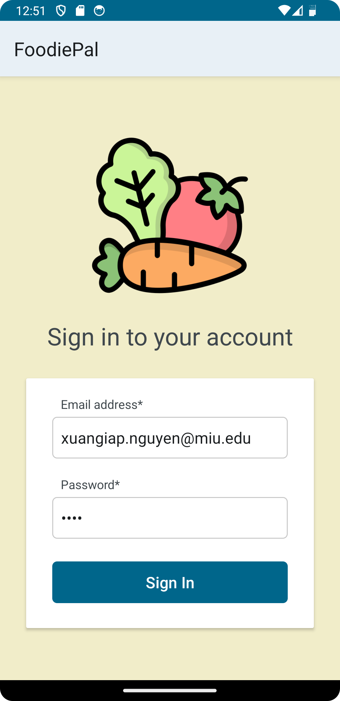
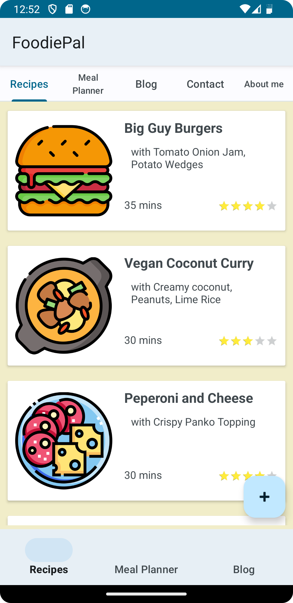
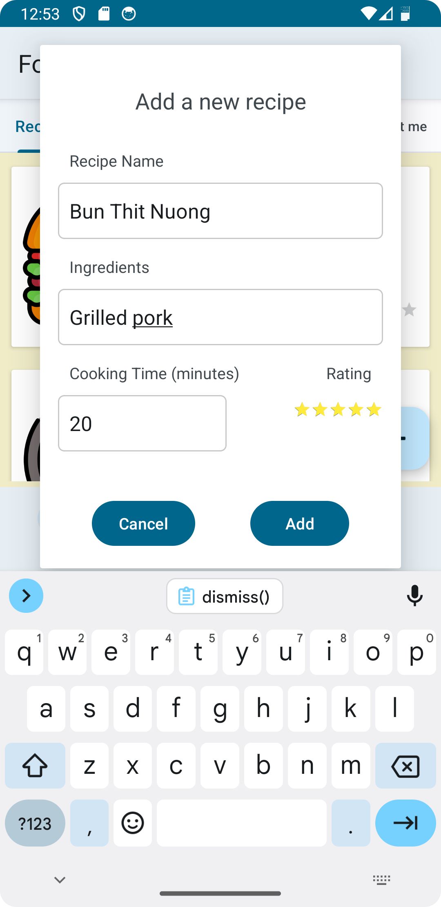
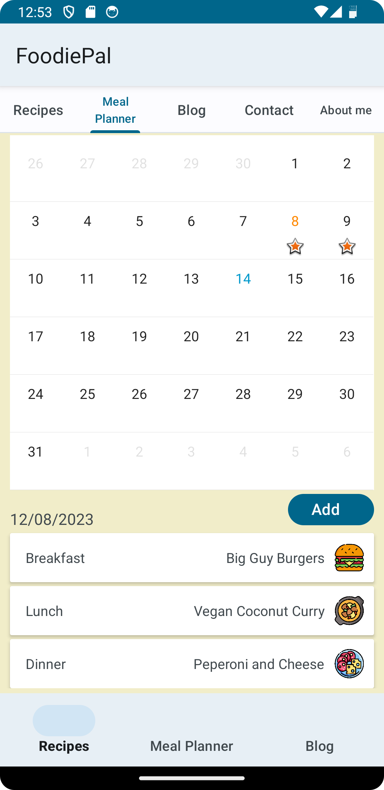
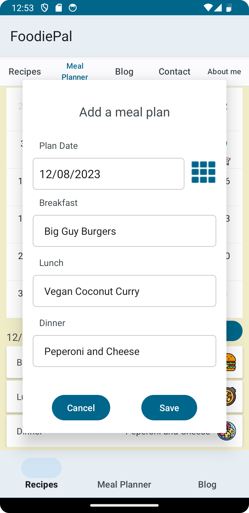
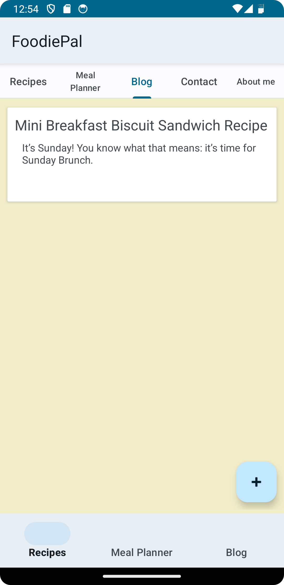
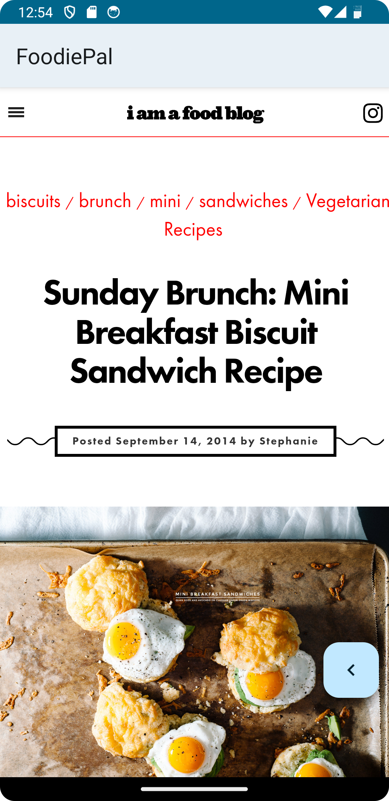
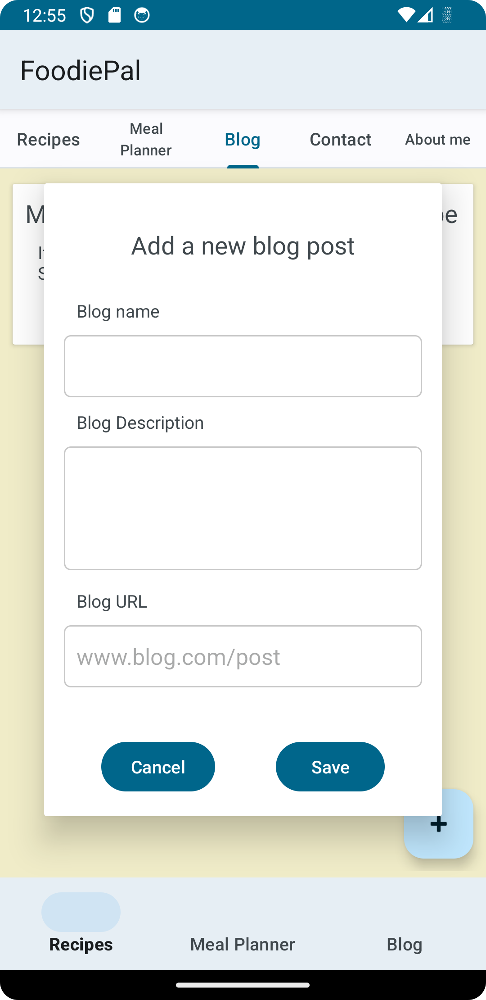
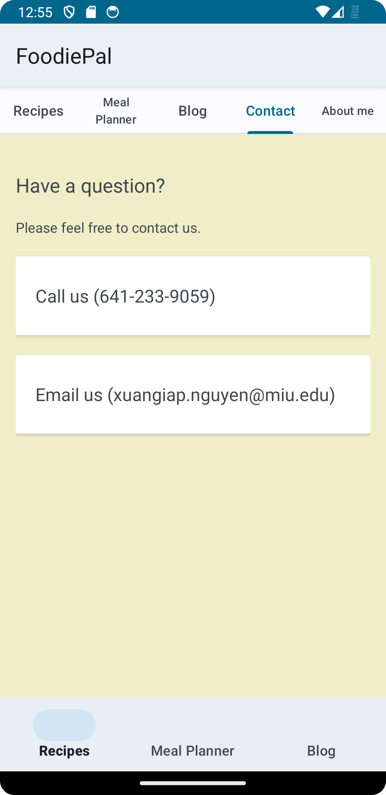
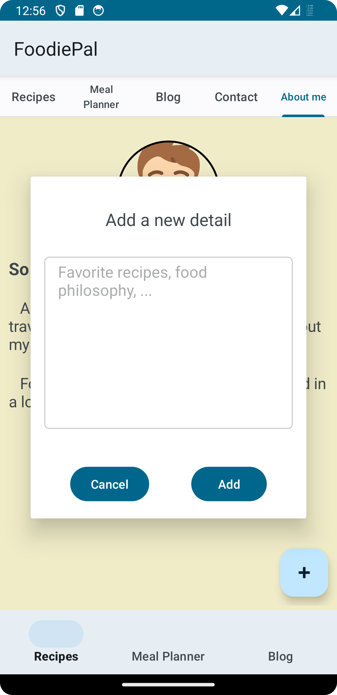

# Mobile Device Programing - Xuan Giap Nguyen

# Screenshots

<h2>Lesson 7</h2>

Screenshot login         | 
:-------------------------:
 | |

Screenshot recipes       | Screenshot recipes add     |
:-------------------------:|:-------------------------:
 | 

Screenshot mealPlanner  | Screenshot mealPlanner add     |
:-------------------------:|:-------------------------:
 |  

Screenshot blogs  | Screenshot blogs view     | Screenshot blogs add     |
:-------------------------:|:-------------------------:|:-------------------------:
 |  | 

Screenshot contact
:-------------------------:
 

Screenshot aboutMe | Screenshot aboutMe add   
:-------------------------:|:-------------------------:
 | 
